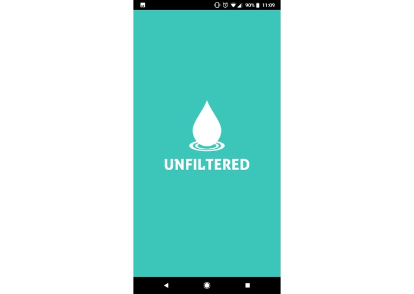
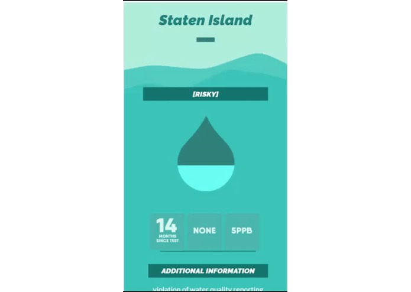
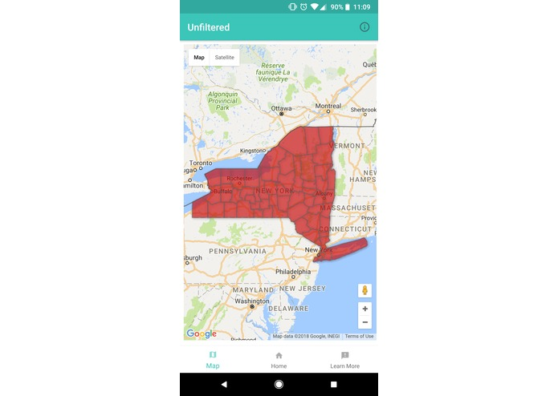
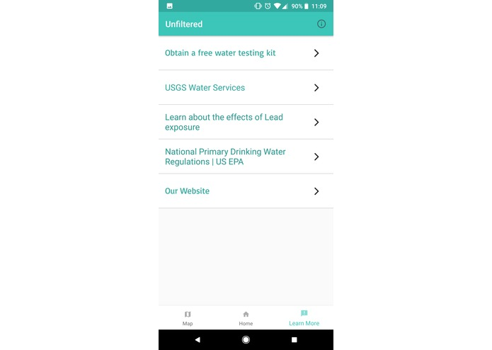

Unfiltered
==========================================================

NOTE:
-----
This project has been offically archived. This project will be remade using React Native.
(Newest version build on React with Expo will be updated in a new Repository by end of 2018).

Inspiration
-----------

"The Unfiltered Project seeks to address the apparent lack of government accountability for the safety of public drinking water by unclouding the elusive information on both the regularity and the results of water quality tests in the public water system in their location. The Unfiltered Team believes in empowering citizens by making information on water testing more accessible to the public, as well as by decoding the policy jargon from government data sets into clear, transparent language."

What it does
------------

The application does three things. First it gives you a map interface that highlights all the counties in each state. Clicking on the state will bring up the county's latest water quality test results. Next, the app allows users to search their specific county&state for its water quality test results. Lastly, the app provides links and resources to important water quality information links and also includes the link to obtain a free water testing kit through the NYC's government website.

How we built it
---------------
We used Android Studio along with the Fusion Table & Google Maps API to provide county and current location information. We also used SQL to organize the data sets and used Domain.com to host our website and mobile web pages for the application.

Challenges we ran into
----------------------
Integrating the map into the application. Obtaining data from the USGS.

Accomplishments that we're proud of
------------------------------------
We were able to obtain data on every county in New York City.

What we learned
---------------
How to use Fusion-Table-APIs, Domain/Website creation, and Android Application creation

What's next for Unfiltered
--------------------------
Expanding data to on all states and counties and forecasting the risk of water-related diseases to people in contaminated regions. Making information more easily accessible to the public.
